# 🧠 Smart Interview Simulator

An adaptive AI-powered interview preparation platform that simulates real interviews across technical, academic, and competitive domains. Personalises questions based on your syllabus, job description, difficulty level, and weak areas — with voice mode, performance tracking, and strict AI evaluation.

---

## ✨ Features

### Three Interview Modes
- **📚 Exam Prep** — University exams (paste your actual syllabus) or Competitive exams (GATE, UPSC, JEE, NEET, CAT, Banking, NDA, CDS, CLAT, CUET and 20+ more)
- **🏢 Company Interview** — Paste a real job description and the AI asks questions about the exact technologies and skills listed
- **🎯 Free Practice** — Choose a learning path, pick from 40+ topics, set daily goals, and track streaks

### Three Question Types
- **Open Ended** — Type your answer, AI evaluates and scores with full feedback
- **MCQ** — Four options with instant correct/incorrect scoring
- **Fill in the Blank** — Complete the statement with a precise term

### Three Difficulty Levels
- **Easy** — First-year basics and definitions
- **Medium** — Application, comparison, and trade-off reasoning
- **Hard** — Deep internals, formal analysis, and expert-level architecture

### Voice Interview Mode
- AI speaks questions aloud like a real interviewer
- Answer via microphone — review and edit transcript before submitting
- AI reads feedback and ideal answer aloud after evaluation
- Ask the AI anything mid-session — hints, clarifications, concept explanations
- Available for Open Ended questions in Free Practice and Company Interview

### Adaptive Engine
- Tracks performance per topic across the session
- Detects your weakest topic and focuses next question there
- Prevents topic and question repetition using dual-layer tracking
- Pre-fetches next question during feedback so there is no loading delay

### Strict AI Evaluation
- Nonsense and empty answers automatically score 0
- Wrong answers are called wrong — never "partially correct"
- Post-processing enforces score caps based on answer quality and length
- Every evaluation includes a complete ideal answer at the right difficulty depth

### Dashboard and Analytics
- Session history grouped by date
- Topic-wise performance bar charts and radar charts
- Detailed per-session report with every question, your answer, and the ideal answer
- Overall band: Excellent, Good, Average, Needs Improvement

---

## 📁 Project Structure

```text 
interview-simulator/
│
├── server/
│   │
│   ├── server.js
│   │
│   ├── config/
│   │   └── db.js
│   │
│   ├── middleware/
│   │   └── authMiddleware.js
│   │
│   ├── models/
│   │   ├── userModel.js
│   │   └── sessionModel.js
│   │
│   ├── routes/
│   │   ├── authRoutes.js
│   │   ├── interviewRoutes.js
│   │   └── voiceRoutes.js
│   │
│   ├── controllers/
│   │   └── interviewController.js
│   │
│   ├── services/
│   │   ├── aiService.js
│   │   └── performanceService.js
│   │
│   └── .env.example
│
└── client/
    │
    └── src/
        │
        ├── App.js
        ├── App.css
        │
        ├── hooks/
        │   ├── useAuth.js
        │   ├── useInterview.js
        │   └── useVoiceInterview.js
        │
        ├── pages/
        │   ├── AuthPage.jsx
        │   ├── SetupPage.jsx
        │   ├── InterviewPage.jsx
        │   ├── ResultsPage.jsx
        │   └── DashboardPage.jsx
        │
        ├── components/
        │   ├── ScoreBadge.jsx
        │   ├── TopicTag.jsx
        │   └── VoiceInterviewer.jsx
        │
        └── utils/
            └── api.js
```

## 📸 Screenshots

### ⚙️ Session Configuration
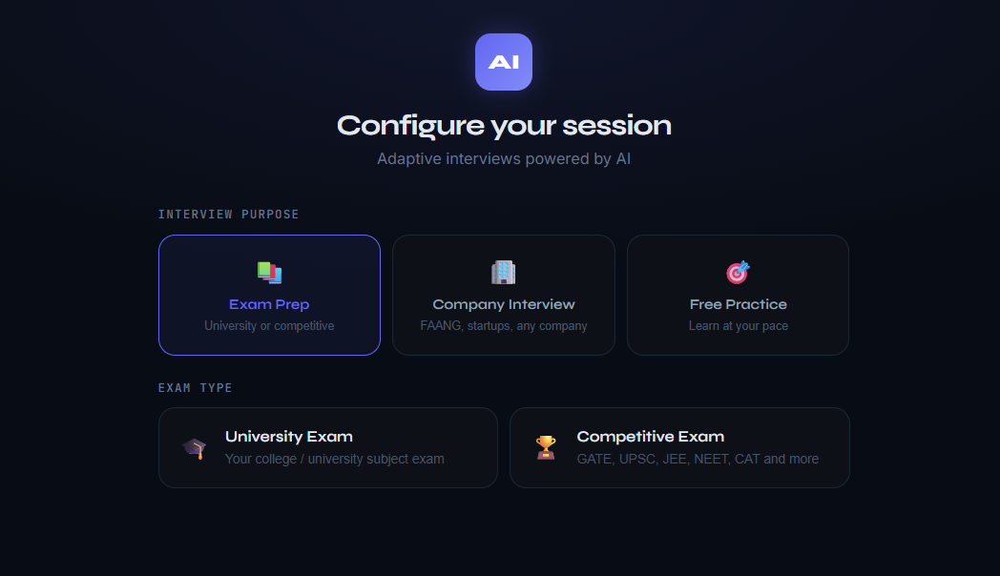

### 🎓 University Exam Setup
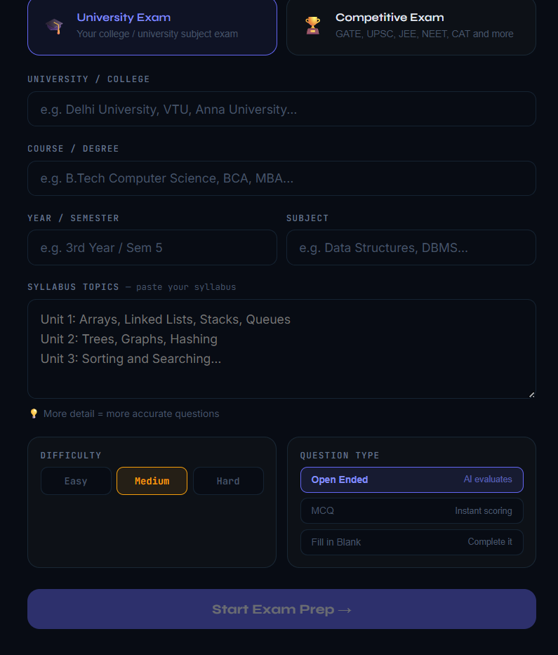

### 🏆 Competitive Exam Mode
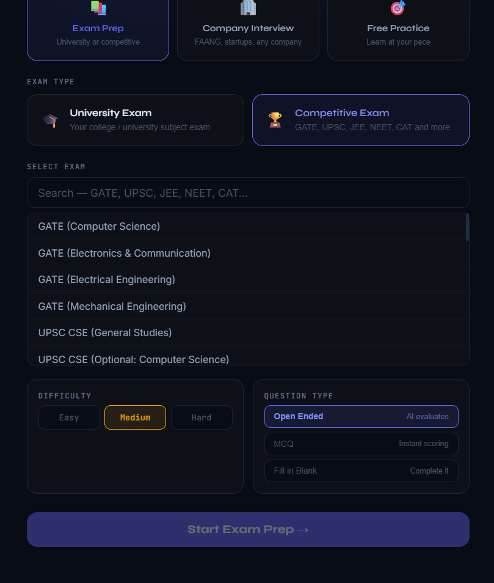

### 🏢 Company Interview Mode
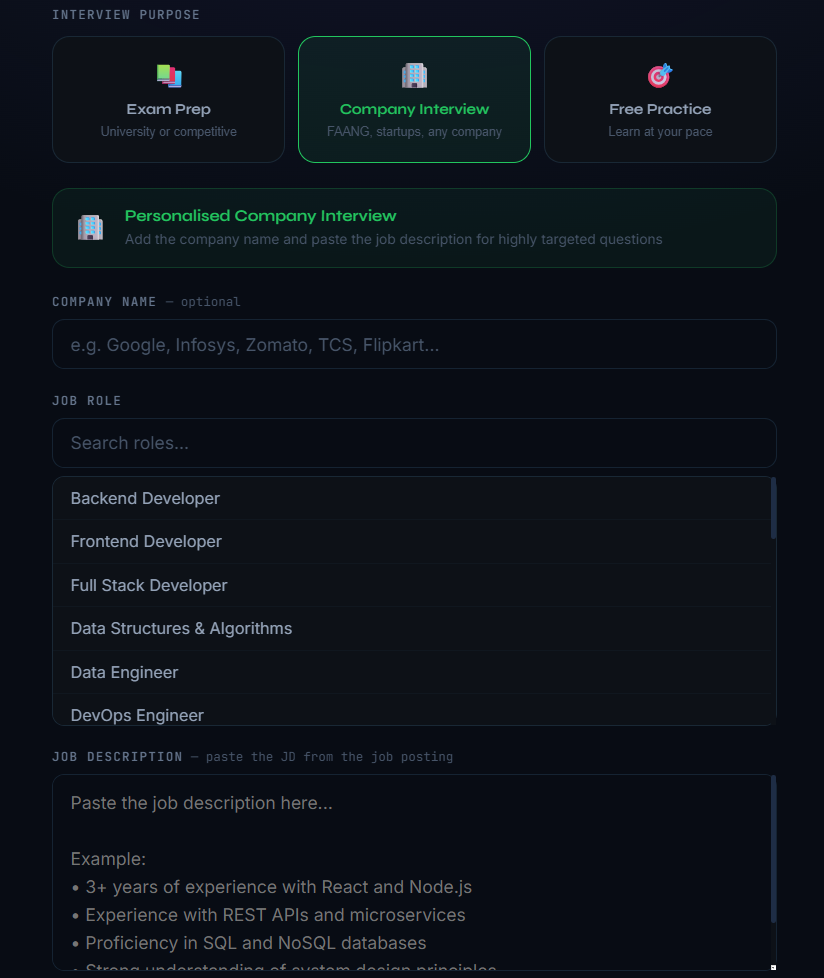

### 🎯 Free Practice Learning Path
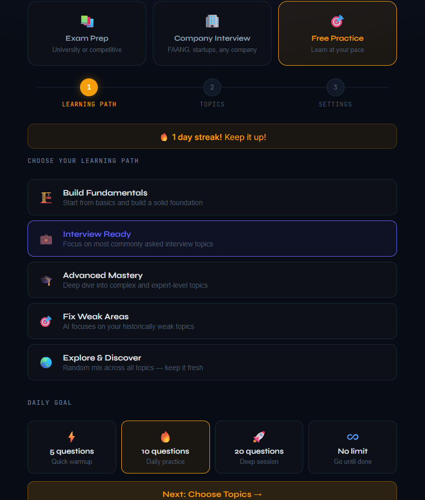

### 🧠 Exam Preparation Setup
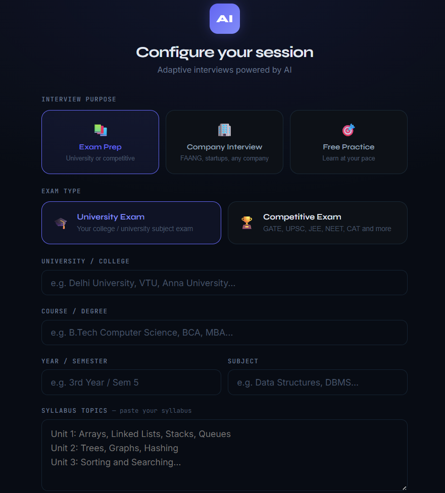

### 🎤 Open Ended Questions with Voice Mode
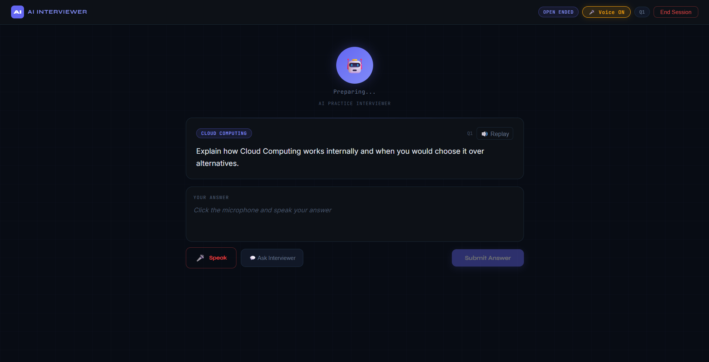

### 💬 Ask Interviewer Feature
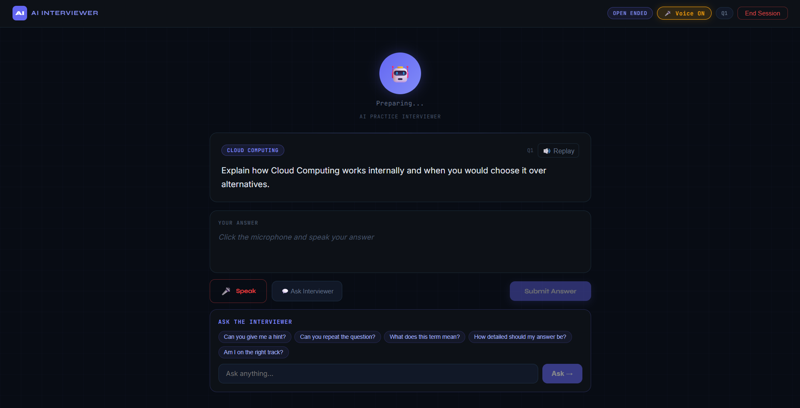

### 📊 Dashboard & Analytics
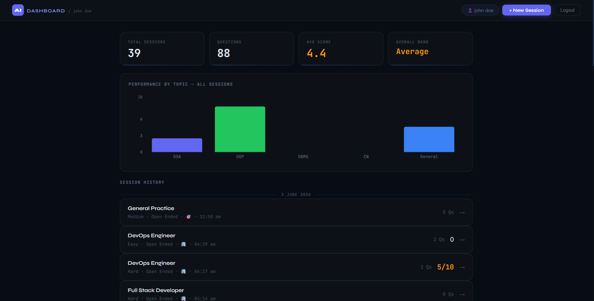

### 📝 MCQ Interview Mode
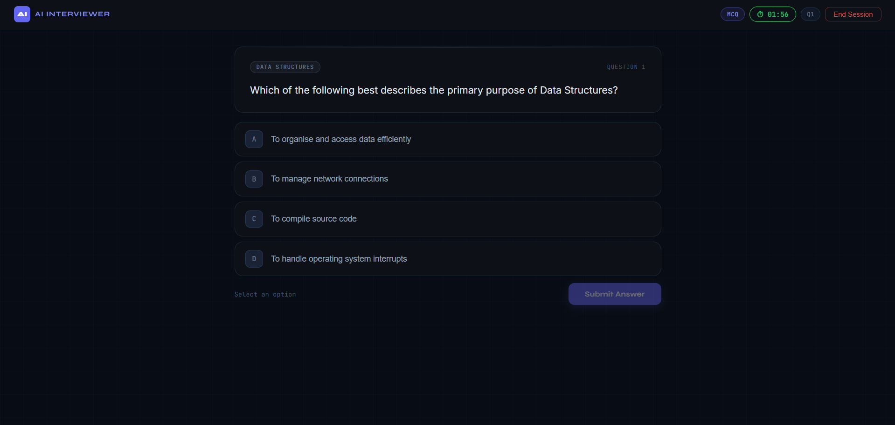

### ✍️ Fill in the Blank Questions
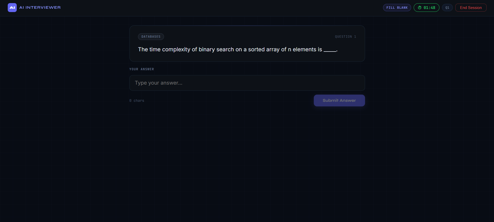

### ❌ AI Evaluation & Feedback
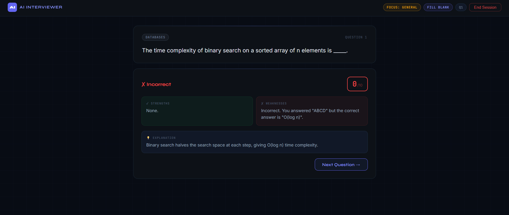


## 🚀 Quick Start

### Prerequisites
- Node.js 18+
- MongoDB (local) or MongoDB Atlas account
- OpenAI API key
- Groq API key (free — for voice chat)

### 1. Clone and install

```bash
git clone https://github.com/yourusername/interview-simulator.git
cd interview-simulator
```

### 2. Backend setup

```bash
cd server
npm install
cp .env.example .env
# Fill in your keys in .env
npm run dev
```

### 3. Frontend setup

```bash
cd client
npm install
npm start
```

Frontend runs at `http://localhost:3000`
Backend runs at `http://localhost:5000`

### 4. MongoDB

Start local MongoDB:
```bash
net start MongoDB        # Windows
brew services start mongodb-community  # Mac
```

Or use MongoDB Atlas and paste the connection string in `MONGO_URI`.

---

## ⚙️ Environment Variables

Create `server/.env`:

```env
PORT=5000
MONGO_URI=mongodb://localhost:27017/interview-simulator
OPENAI_API_KEY=sk-your-openai-key
GROQ_API_KEY=gsk_your-groq-key
AI_PROVIDER=openai
CLIENT_URL=http://localhost:3000
JWT_SECRET=your-secret-key-here
```

| Variable | Required | Description |
|----------|----------|-------------|
| `MONGO_URI` | ✅ | MongoDB connection string |
| `OPENAI_API_KEY` | ✅ | For question generation and evaluation |
| `GROQ_API_KEY` | ✅ | For voice chat (free at console.groq.com) |
| `JWT_SECRET` | ✅ | Any long random string for token signing |
| `AI_PROVIDER` | ✅ | `openai` or `gemini` |
| `CLIENT_URL` | ✅ | Frontend URL for CORS |

---

## 🔌 API Reference

### Auth
| Method | Endpoint | Description |
|--------|----------|-------------|
| POST | `/api/auth/register` | Create account |
| POST | `/api/auth/login` | Login, returns JWT |
| GET | `/api/auth/me` | Get current user |

### Session
| Method | Endpoint | Description |
|--------|----------|-------------|
| POST | `/api/session/start` | Start new session |
| POST | `/api/session/answer` | Submit answer, get evaluation + next question |
| POST | `/api/session/end` | End session, get summary |
| GET | `/api/session/:id` | Get session details |
| GET | `/api/history/:userId` | Get all sessions for user |

### Voice
| Method | Endpoint | Description |
|--------|----------|-------------|
| POST | `/api/voice/ask` | Ask AI a question mid-session (Groq) |

All session and history routes require `Authorization: Bearer <token>` header.

---

## 🗃️ Data Model

### Session
```js
{
  userId, role, difficulty, questionType, purpose,
  purposeMeta: {
    // University
    examType, university, course, semester, subject, syllabus,
    // Competitive
    exam,
    // Company
    companyName, jobDescription,
    // Practice
    learningPath, selectedTopics, dailyGoal
  },
  history: [{ question, answer, score, topic, strengths, weaknesses, idealAnswer, followUp }],
  askedTopics: [],     // prevents topic repetition
  performance: { DSA, OOP, DBMS, OS, CN, General },
  isActive
}
```

---

## 🤖 How the AI Works

### Question Generation
1. Picks an unused topic from the syllabus, selected topics, or role profile
2. Builds a domain context block from purposeMeta (university details, JD, exam)
3. Calls GPT-3.5 with strict difficulty specs and a list of already-asked questions
4. Checks new question for 40% word overlap with previous questions — retries up to 5 times if too similar

### Evaluation
1. Pre-checks for nonsense: too short, repeated words, no real content → score 0
2. Single AI call returns score, strengths, weaknesses, and complete ideal answer
3. Post-processing enforces caps: wrong answer → max 3, no strengths → max 2, too short → max 4
4. Score bands: 0-2 wrong, 3-4 shallow, 5-6 partial, 7-8 good, 9-10 excellent

### Voice Chat
- Groq `llama-3.1-8b-instant` via backend route (avoids browser CORS)
- Responds in 2-3 conversational sentences
- Gives hints without revealing full answers

---

## 🌐 Deployment

| Component | Platform |
|-----------|----------|
| Frontend | Vercel |
| Backend | Render |
| Database | MongoDB Atlas |

---

## 🛡️ Security

- Passwords hashed with bcrypt (10 salt rounds)
- JWT authentication with 7-day expiry
- Rate limiting on all API routes
- All AI API keys kept server-side only — never exposed to the browser
- CORS restricted to `CLIENT_URL`

---

## 🧭 Supported Roles and Exams

**50+ technical roles** including Backend, Frontend, Full Stack, Data Science, ML, DevOps, Cloud, Cybersecurity, Product Management and more.

**30+ competitive exams** including GATE (CS, ECE, EE, ME), UPSC CSE, IAS, IPS, IRS, IFS, IBPS PO, SBI PO, RBI Grade B, SSC CGL, SSC CHSL, NDA, CDS, JEE, NEET, CAT, CLAT, CUET, DRDO, ISRO, Railways RRB.

**University exams** — any university, any course, any semester. Paste your syllabus for targeted questions.

---

## 🙋 FAQ

**Does it work without an OpenAI key?**
You can switch to Gemini by setting `AI_PROVIDER=gemini` and providing a `GEMINI_API_KEY`. The Groq key (free) is only needed for voice chat.

**Does voice mode work on all browsers?**
Voice mode uses the Web Speech API which is only supported on Chrome and Edge. Firefox and Safari are not supported.

**Can I use MongoDB Atlas instead of local MongoDB?**
Yes. Replace `MONGO_URI` with your Atlas connection string.

**Why does the start button look disabled for company interview?**
You need to either select a role from the dropdown or type one manually. The button enables as soon as a role is present.
